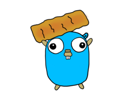

# Goquette

With **Goquette** you can simplify your packaging experience with NuGet. \
Set up the required files - Steps are listed below - and just run **Goquette**, and you're done.



## Usage:

* Create a 'goquette.yaml' File inside your root project folder
* Create a 'tools' directory inside your root projekt folder

Inside the `tools`-Directory, put your PowerShell scripts, which are consumed by chocolatey, \
and your zipped program/binary.
Take a look at the tools-Directory inside this **[Tools-Dir of Goquette](https://github.com/PatrickLaabs/goquette/tree/main/tools)** \
for a better understanding.

## Installation

### Install via Go
`go install github.com/PatrickLaabs/goquette@latest` \
Make sure you have set your GOBIN Path correctly. \
If not:
```
export GOBIN="$GOPATH/bin"
export PATH="$PATH:$GOBIN"
```
### Build Goquette-Binary with Go
Make sure you have a working installation of Go. Its easy to set up - just follow the official documentations. \
Fork this repository and run `go build .` inside this project folder.

### Pre-Compiled Binary
Download the pre-compiled binary of **Goquette** from the 'Release'-Page on this **[GitHub Page](https://github.com/PatrickLaabs/goquette/releases)**.

* On Windows: \
Move the extraced binary to a folder of your choice and put the path to **Goquette** into the Machine's PATH.
* On Linux & Darwin(macOS): \
Move the extraced binary to `/usr/local/bin`, check for permissions,
and add the path inside your $PATH \
`export PATH=$HOME/bin:/usr/local/bin:$PATH`

## Contribution

Hope you like this project. \
Every contribution is appreciated - feel free to use it in your project, fork it, modify it. Whatever you like :) 

If you experience any issues during setup / running **Goquette**: \
Open an Issue and let me know what's not working for you.

##  Example goquette.yaml

```
id: "<your_project_name>"
version: "<your_software_version>"
title: "<set_a_title>"
authors: "<who's_the_author>"
owners: "<who's_the_owner>"
requireLicenseAcceptance: "<choose_true_or_false>"
description: "<set_a_description>"
summary: "what_does_the_program_do"
tags: "<define_some_tags_for_chocolatey>"
zipPath : "<name_of_your_zipped_file_inside_tools_dir>"
```

---

## Example Tools Folder structure

```
tools/<your_zipped_binary>.zip
tools/<chocolateyinstall.ps1>
tools/<chocolateyuninstall.ps1>`
```

---

## Goquette and Jenkins

```
pipeline {
  agent any
    environment {
        GO111MODULE = 'on'
        CGO_ENABLED = 0
        GOPATH = "${JENKINS_HOME}/jobs/${JOB_NAME}/builds/${BUILD_ID}"
        PATH = "$PATH:$GOBIN"
    }
    tools {
        go 'go-1.17.7'
    }

  stages {
      stage('Preperation and Cleaning workdir') {
          steps {
              withEnv(["GOBIN=${JENKINS_HOME}/jobs/${JOB_NAME}/builds/${BUILD_ID}/bin"]) {
              }
              sh 'rm -rf $JENKINS_HOME/<output_folder>'
              sh 'rm -rf $JENKINS_HOME/<output_folder>/tools'
          }
      }

    stage('Creation of directories') {
        steps {
            sh 'mkdir $JENKINS_HOME/<output_folder>'
            sh 'mkdir $JENKINS_HOME/<output_folder>/tools'
        }
    }

    stage('Build') {
      steps {
        sh 'go build'
        sh 'cp $JENKINS_HOME/workspace/$JOB_NAME/<name_of_compiled_go_binary> $JENKINS_HOME/<output_folder>/tools'
        sh 'cp $JENKINS_HOME/workspace/$JOB_NAME/toolstemp/* $JENKINS_HOME/<output_folder>/tools'
        sh 'cp $JENKINS_HOME/workspace/$JOB_NAME/goquette.yaml $JENKINS_HOME/<output_folder>'
      }
    }

    stage('Goquette') {
        steps {
            sh 'go install github.com/PatrickLaabs/goquette@latest'
            sh 'cd $JENKINS_HOME/<output_folder> && $JENKINS_HOME/jobs/$JOB_NAME/builds/$BUILD_ID/bin/goquette'
            }
        }

    stage('DeployToNexus') {
        steps {
            echo 'deploying to nexus..'
        }
    }
  }
}
```